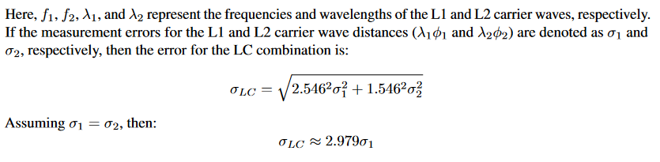

# RTKLib TDCP


## Implementation Details

In fact, the program we used to calculate the TDCP velocity is modified from RTKLIB. In Single mode, this software uses Doppler observations to calculate the velocity of the receiver (and the rate of clock change). To use TDCP for velocity measurement, TDCP observations can replace the original Doppler observations before calculation. We have inserted a new function to generate TDCP observations. The input parameters of the function include all observations `obs_t *obs`, sampling interval `double tint`, and a flag indicating whether to use LC combination `int IFLC`. For adjacent observations `obs->data[i]` and `obs->data[j]` (j>1) of a GPS satellite, the TDCP observation can be calculated using the following pseudocode:

```pseudocode
C1 = (FREQ1^2) / ((FREQ1^2) - (FREQ2^2))
C2 = -(FREQ2^2) / ((FREQ1^2) - (FREQ2^2))

if IFLC=0 then
    tdcp = -(obs->data[j].L[0] - obs->data[i].L[0]) / tint
    dop_delta = if obs->data[j].D[0] = 0.0 then 0 else fabs(tdcp - obs->data[j].D[0])
    if dop_delta < 1 then
        obs->data[j].D[0] = tdcp
    else
        obs->data[j].D[0] = 0.0
    end if
else
    for m = 0 to 1
        tdcp = -(obs->data[j].L[m] - obs->data[i].L[m]) / tint
        dop_delta = if obs->data[j].D[0] = 0.0 then 0 else fabs(tdcp - obs->data[j].D[m])
        flag = if dop_delta < 1 then 0 else 1
    end for
    if flag = 0 then
        range_cpi = C1 * obs->data[i].L[0] * CLIGHT / FREQ1 + C2 * obs->data[i].L[1] * CLIGHT / FREQ2
        range_cpj = C1 * obs->data[j].L[0] * CLIGHT / FREQ1 + C2 * obs->data[j].L[1] * CLIGHT / FREQ2
        tdcp = -(range_cpj - range_cpi) / (CLIGHT / FREQ1) / tint
        obs->data[j].D[0] = tdcp
    else
        obs->data[j].D[0] = 0.0
    end if
end if

```

In this function, for the calculated TDCP observations, the original Doppler is used for cycle slip detection. If the difference between the TDCP observation and the original Doppler is less than 1 cycle/s, it is considered that there are no cycle slips, and the TDCP observation can safely replace the original Doppler. 

To facilitate switching between various configurations, it is best to add an option in the configuration file to enable or disable TDCP.

## Statistical Results of Static Tests

Data collected from December 26, 2022, to March 1, 2023, June 1, 2023, and September 1, 2023, were analyzed. Detailed computation results can be accessed at the following link: [Static Test Computation Results](https://www.jianguoyun.com/p/DeFIsvQQ2PCQBxiW06wFIAA).

| Method  | ve(mm/s) | vn(mm/s) | vu(mm/s)  |
| ------- | -------- | -------- | --------- |
| PPK     | 0±3.6    | 0±5.3    | 0±11.6    |
| Doppler | 0±18.0   | 0±22.9   | 10.8±54.7 |
| LC TDCP | 0±3.7    | 2.4±4.7  | 3.1±13.1  |
| L1 TDCP | 0±2.6    | 2.6±3.7  | 3.1±9.8   |


## LC combination amplifies error

According to the ionosphere-free combination calculated from the carrier phase, the satellite-to-ground distance is given by:




The above derivation indicates that the LC combination amplifies the noise by approximately threefold. This, in turn, is likely to result in a reduction of velocity measurement precision.
Although the noise amplification in the LC combination is approximately threefold, it is important to note that this method effectively eliminates ionospheric influences. Therefore, the actual precision cannot be simply inferred as a threefold relationship. 

> If you need any help or need our codes, please contact us: leiyang@fio.org.cn

